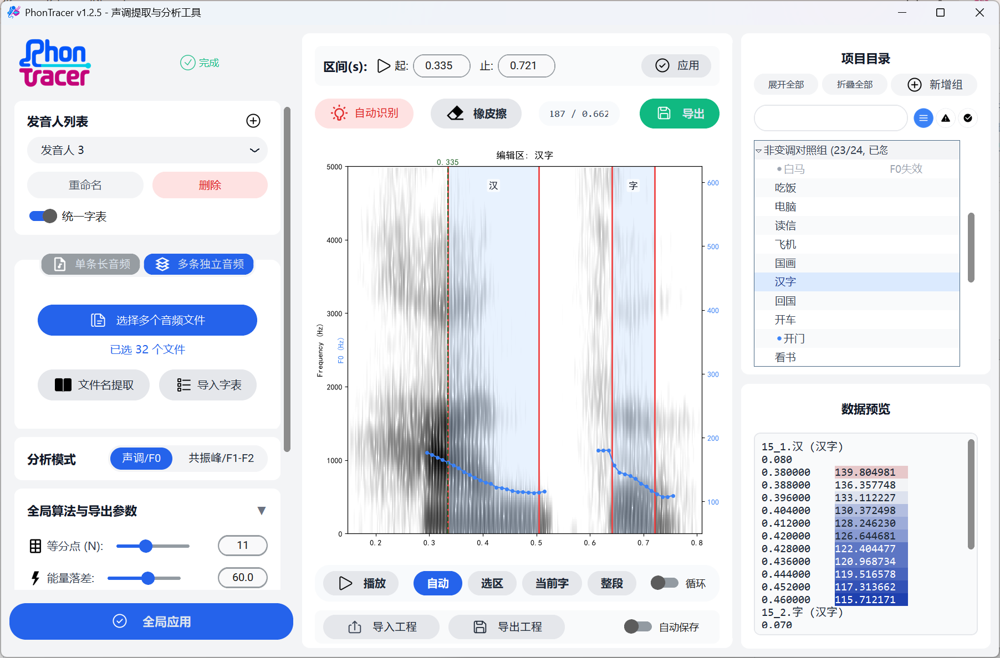
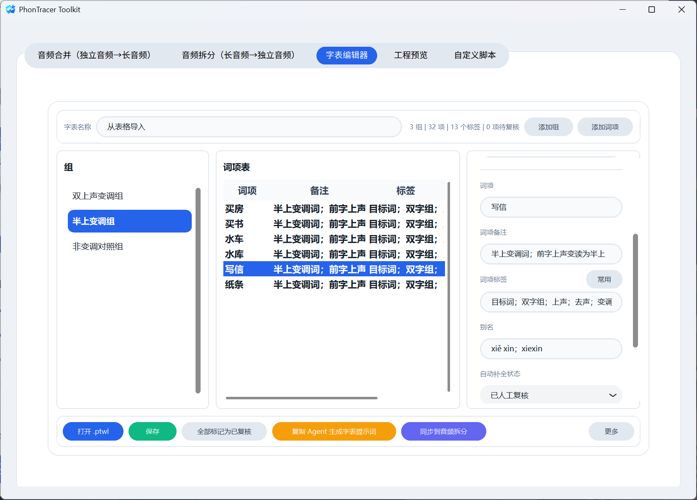
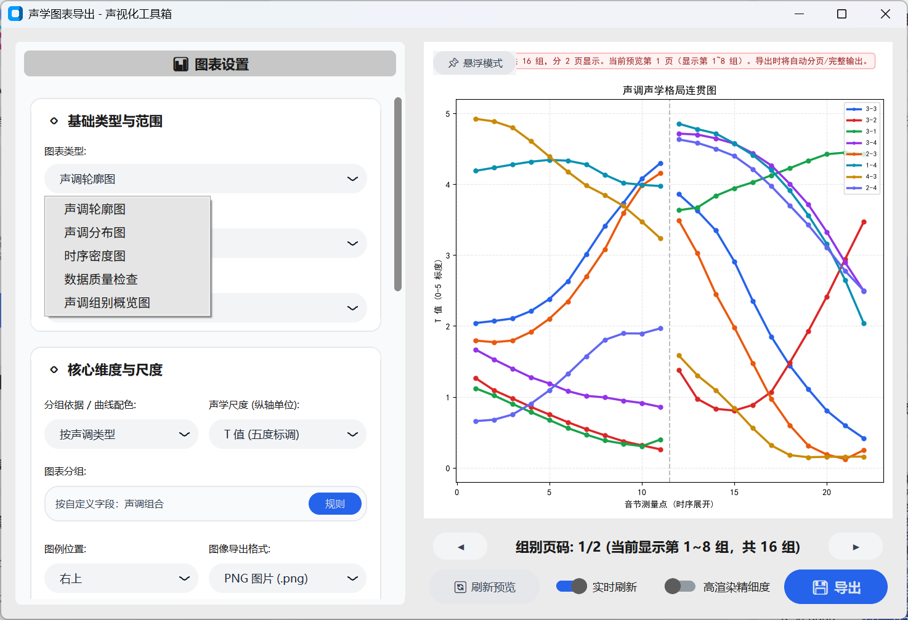
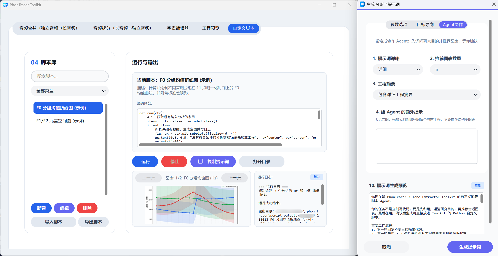
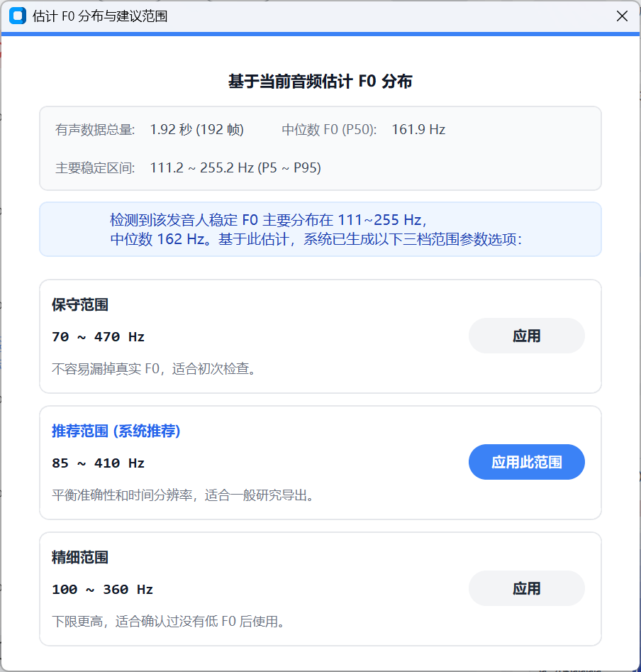
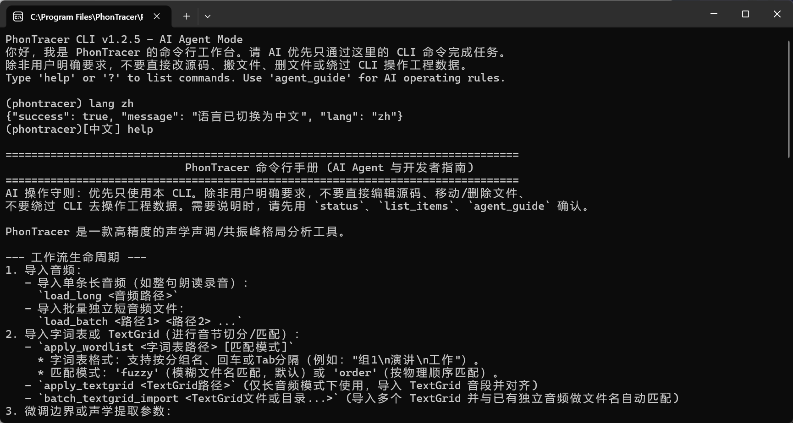
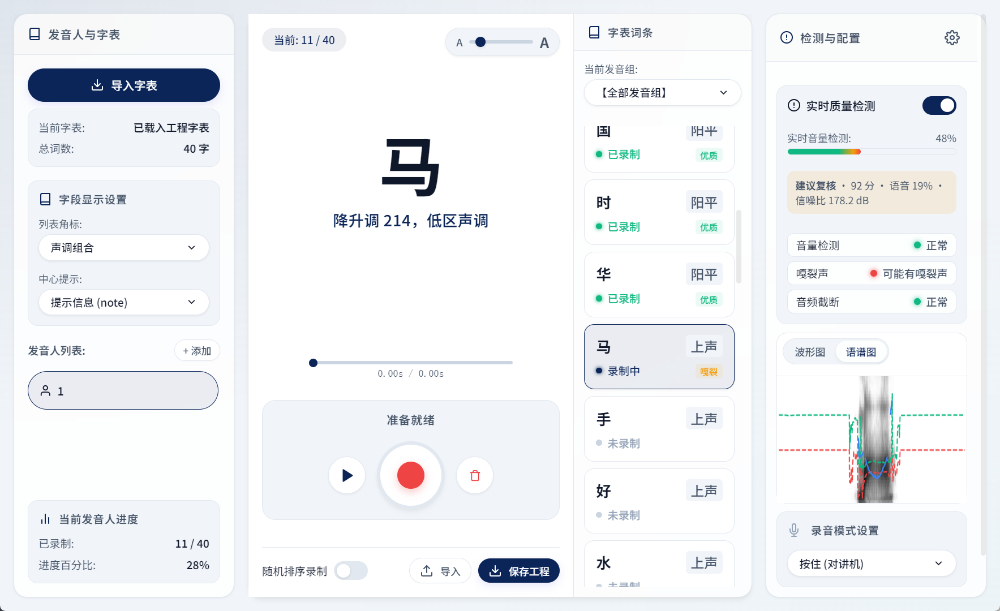
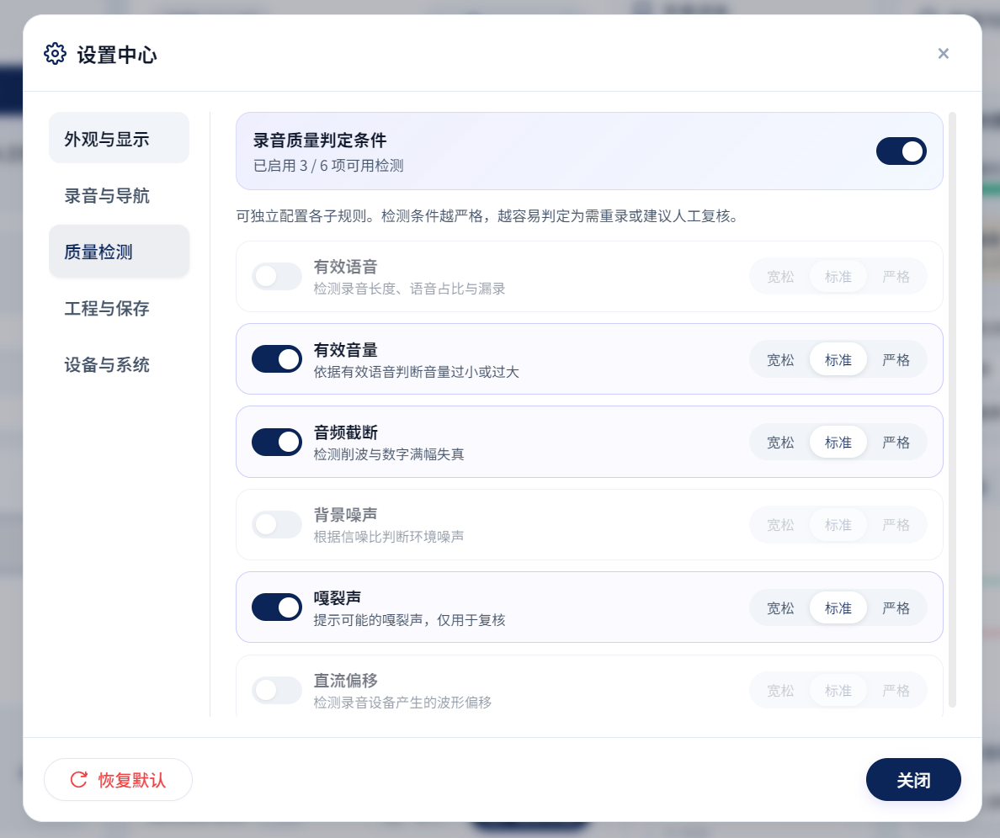
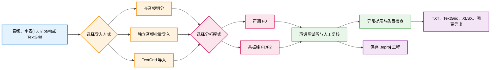

<div align="center">
  
  <h1>PhonTracer</h1>
  <p><strong>面向语音学标注与声学分析的桌面工具套件</strong></p>

  <p>
    <a href="https://github.com/KasumiKitsune/PhonTracer/releases"></a>
    <a href="https://www.python.org/"></a>
    <a href="#安装"></a>
    
  </p>
</div>

---

###  项目简介

> **PhonTracer** 是一个面向语音学标注与声学分析的桌面工具套件，支持批量提取和人工复核声调 `F0`、共振峰 `F1/F2`，并提供 `.teproj` 工程保存、异常提示、多说话人管理、科学图表导出和 Windows 命令行工作台。

项目底层通过 [Parselmouth](https://parselmouth.readthedocs.io/) 调用 **Praat** 的声学分析能力，适合需要“自动提取 + 可视化复核 + 批量导出”工作流的研究和教学场景。

---

###  界面预览

<table width="100%">
  <tr>
    <td width="50%" align="center">
      <br>
      <b>主程序 F0 分析与人工复核界面</b>
    </td>
    <td width="50%" align="center">
      <br>
      <b>Toolkit 高级字表 (.ptwl) 编辑器</b>
    </td>
  </tr>
  <tr>
    <td width="50%" align="center">
      <br>
      <b>声学科学可视化工具箱</b>
    </td>
    <td width="50%" align="center">
      <br>
      <b>自定义脚本沙箱与 AI 协作面板</b>
    </td>
  </tr>
  <tr>
    <td width="50%" align="center">
      <br>
      <b>发音人 F0 估计与参数推荐对话框</b>
    </td>
    <td width="50%" align="center">
      <br>
      <b>PhonTracerCLI 交互式命令行控制台</b>
    </td>
  </tr>
  <tr>
    <td width="50%" align="center">
      <br>
      <b>PhonRec 录音配套工具主界面</b>
    </td>
    <td width="50%" align="center">
      <br>
      <b>PhonRec 设置与质量检测配置</b>
    </td>
  </tr>
</table>

---

###  核心能力

- **双分析模式**：支持声调 `F0` 与共振峰 `F1/F2` 提取，可按任务切换分析模式。
- **自动分析与人工复核结合**：在声谱图中查看轮廓、试听音频、调整边界，并使用橡皮擦工具删除明显异常的分析点。
- **两类导入流程**：支持“长音频 + 字表”切分，也支持批量导入独立音频文件。
- **TextGrid 互操作**：支持导入和导出 TextGrid，便于与 Praat 工作流衔接。
- **高级字表 (`.ptwl`) 与元数据穿透**：支持带结构的 JSON 格式高级字表。导入后，组名、组标签、组备注、词项别名、自定义科研字段和人工复核状态将随 `.teproj` 穿透并附加于每个切分项，可在画图、导出或自定义脚本中调用。
- **发音人多维隔离**：每位发音人拥有独立的工作区、F0 与共振峰参数；支持单条目参数隔离（局部参数微调不污染同发音人的其他词项），并提供右键属性窗口核对参数来源。
- **异常提示**：在项目树中提示边界问题、分析点缺失、跳变异常和跨边界拆分风险，并提供项目树右侧状态短标签（如 `+N` 等）辅助定位需复核条目。
- **科学图表分组规则**：支持按“词项标签”、“组标签”、“复核状态”或“自定义科研字段”临时对图表重组上色；对符合特定格式的二字组数据自动支持调类效应时程图和均值热图。
- **自定义脚本沙箱与 AI 协作**：Toolkit 内置受控 Python 执行沙箱（可使用 numpy, scipy, matplotlib，禁用系统访问和未允许的库），支持一键生成工程概要 AI 提示词，由 AI 协作生成绘图代码，并支持将执行记录写入 `.teproj` 以供归档。
- **工程归档与报告生成**：支持将完整状态保存为 `.teproj`。在 Toolkit 中可直接导出包含工程 SHA-256 文件指纹、元数据和脚本记录的研究方法报告。

---

###  套件组成

<table width="100%">
  <tr>
    <th width="20%">入口</th>
    <th width="50%">用途</th>
    <th width="30%">平台说明</th>
  </tr>
  <tr>
    <td><b>PhonTracer</b></td>
    <td>主桌面程序：导入、分析、人工复核、异常检查、参数隔离、工程保存和导出。</td>
    <td>Windows x64 / ARM64、macOS</td>
  </tr>
  <tr>
    <td><b>Toolkit</b></td>
    <td>独立处理工作台：音频合并、长音频切分、高级字表 (.ptwl) 编辑、自定义 Python 脚本沙箱运行及研究方法报告生成。</td>
    <td>Windows x64 / ARM64、macOS</td>
  </tr>
  <tr>
    <td><b>PhonRec</b></td>
    <td>轻量化录音配套工具：支持多发音人分词录音、声级计与削波检查、语音活动检测（VAD），支持独立软件模式与主程序数据互通。</td>
    <td>Windows x64 / ARM64、macOS (仅限 Apple Silicon)</td>
  </tr>
  <tr>
    <td><b>PhonTracerCLI</b></td>
    <td>面向批处理与 AI 代理的命令行交互式/静默执行工作台，支持自定义脚本库指令。</td>
    <td>当前随 Windows 套件发布</td>
  </tr>
</table>

---

###  工作流程



**一个典型工作流如下：**

1. 创建或切换发音人，并设置适合该发音人的分析参数。
2. 导入长音频和字表（普通字表或 `.ptwl` 高级字表）、批量导入独立音频，或载入已有 TextGrid。
3. 选择声调 `F0` 或共振峰 `F1/F2` 模式并执行分析。
4. 在声谱图中试听音频、检查分段边界和分析点，必要时通过橡皮擦/剔除点工具手动修正。
5. 根据项目树中的异常提示或右键属性窗口复核可疑条目的底层配置。
6. 导出所需的数据报告、自定义分组科学图表或 TextGrid。
7. 将当前工作保存为 `.teproj` 工程，或载入 Toolkit 进行高级字表编辑、沙盒脚本绘图和生成归档报告。

---

###  分析模式

#### 声调 F0
- 默认通过 Parselmouth 调用 Praat 自相关音高分析。
- 支持设置音高下限、音高上限、静音阈值、前端跳过比例和浊音阈值。
- 支持按发音人估计推荐 F0 范围（提供保守、推荐、精细三档）。
- 支持在声谱图中检查轮廓，并删除明显异常的 F0 点。
- 对无法可靠测量的片段保留缺失值，避免将嘎裂声等异常发声误当作稳定 F0。

#### 共振峰 F1/F2
- 通过 Parselmouth 调用 Praat 的 Burg 共振峰分析。
- 支持提取和显示 `F1`、`F2`，内部同时保留 `F3` 数据用于导出和检查。
- 支持在声谱图中检查共振峰轨迹，并删除明显异常的分析点（采用点定位算法）。
- 支持根据当前发音人的样本生成参数建议。

**共振峰主要参数说明：**

| 参数 | 内部字段 | 默认值 | 说明 |
| --- | --- | --- | --- |
| 共振峰分析上限 | `formant_max_hz` | `5500` | 控制 Praat Burg 搜索范围，并非 F2 数值上限 |
| 共振峰数量 | `formant_count` | `5` | Praat Burg 分析参数 |
| 窗长 | `formant_window_length` | `0.025` | 单位为秒 |
| 预加重 | `formant_pre_emphasis` | `50` | 单位为赫兹 |
| 采样策略 | `formant_sample_strategy` | `整段11点` | 控制导出时的采样位置 |

---

###  输入与复核

#### 输入方式

PhonTracer 支持三类常见输入流程：

| 输入方式 | 适用场景 | 说明 |
| --- | --- | --- |
| **长音频 + 字表** | 连续录音按词条拆分 | 支持普通文本（分组名/词项）与高级字表 `.ptwl` 格式 |
| **独立音频批量导入** | 每个词条已有单独音频文件 | 支持 `WAV` 和 `MP3` 文件，提供模糊匹配和顺序匹配模式 |
| **TextGrid 导入** | 已有 Praat 标注或需要继续复核 | 支持载入已有分段信息，并在当前工程中继续分析 |

#### 人工复核与异常提示

自动提取不是最终结论。PhonTracer 将分析结果放回可试听、可编辑的声谱图界面，帮助用户完成复核：

- 播放当前音频并查看声谱图
- 调整词条和字符边界（鼠标左右拖拽红蓝虚线）
- 检查 F0 轮廓或共振峰轨迹，利用滚轮调节十字准星感应半径进行异常点剔除
- 在项目树中定位“需要检查”的条目（根据状态短标签快速定位）

> [!NOTE]
> 项目树会针对边界异常、分析点缺失、有效点比例不足、跳变异常以及跨边界拆分风险给出提示。提示用于辅助人工检查，不应被理解为自动质量认证。

---

###  工程保存与恢复

PhonTracer 使用 `.teproj` 作为可移植工程归档格式。工程可保存：

- 发音人和参数设置
- 导入的音频副本
- 条目、分组、边界信息及高级字表元数据
- F0 与共振峰分析结果
- 人工删除或调整后的分析状态
- 自定义脚本的执行记录、源码及运行日志

导入已有工程时，程序会先显示预览；如果当前工作区已有内容，可选择覆盖或叠加导入。

> [!TIP]
> 启用自动保存后，程序会将当前状态写入内部恢复工作区，并在下次启动时提供恢复提示。需要跨设备传输、迁移或分享时，请显式导出 `.teproj` 工程。

---

###  导出能力

| 类别 | 格式 | 适用场景 |
| --- | --- | --- |
| **文本数据** | `TXT` | 轻量查看和后续脚本处理；文本结果采用制表符分隔 |
| **Praat 标注** | `TextGrid` | 导出包含 `groups` (组别), `words` (词项), `chars` (音节) 的 IntervalTier，自动填充静音区间 |
| **表格分析** | `XLSX` | 包含数据和分析结果页，自动在 Excel 底层注入基频 T 值活公式和共振峰均值/离散度活公式，保留高级字表元数据 |
| **科学图表** | `PNG`、`SVG`、`PDF` | 支持当前/分发音人/整合导出，支持自定义分组重新上色，PDF 自动分页 |
| **工程归档** | `.teproj` | 保存完整分析状态、缓存、指纹及脚本运行历史 |

---

###  PhonRec 录音配套工具

<p align="center">
  
</p>

PhonRec 是基于 React、Vite 与 Tauri v2 构建的轻量化录音辅助工具。为了方便野外调查或多发音人录音，PhonRec 客户端不打包 Python 及大型科学计算库，支持以下两种运行模式：

#### 完整模式
当系统已安装 PhonTracer 且版本兼容时，PhonRec 在启动时会自动对接本地的 PhonTracer 分析引擎。在此模式下，录音完成后将自动调用 PhonTracer 分析引擎获取精细声学参数，并在前端渲染语谱图与完整的录音质量分析。

#### 独立软件模式
如果系统未安装 PhonTracer，或者引擎启动失败，用户可选择进入“独立软件模式”。该模式完全运行在本地 Rust 底层和前端轻量计算上，无任何外部依赖：
* **录音与播放**：支持麦克风录音，以及 Windows 系统的音频回环（Loopback）录音与播放。
* **录音质量反馈**：提供实时波形绘制、语音活动检测（VAD）、音量声级计（VU Meter）与录音削波检测。
* **字表与工程管理**：支持普通 TXT/CSV 字表与高级 `.ptwl` 结构化字表导入；支持保存和加载 `.teproj` 工程，与主程序共享工作区以实现数据互通。
* **批量导出**：支持按“发音人/分组/词项”层级结构批量导出命名规范的单字/词 WAV 音频文件。

*注：独立软件模式下不提供语谱图渲染和基频/共振峰分析，但与完整模式共用工作区。以后安装或修复 PhonTracer 后，完整模式可无损继续读取已有录音。*

---

###  安装与快速开始

#### 安装

请优先从 [GitHub Releases](https://github.com/KasumiKitsune/PhonTracer/releases) 下载已构建版本。

请按系统和用途下载对应资产；主套件与独立 PhonRec 是分开的安装包。

| 用途 | 平台 | 发布资产 | 内容与边界 |
|---|---|---|---|
| 主套件安装 | Windows x64 | `PhonTracer_Setup_Windows_x64.exe` | PhonTracer、Toolkit、CLI 与本地分析引擎；注册 `.teproj`、`.ptwl` 文件关联 |
| 主套件便携 | Windows x64 | `PhonTracer_Suite-Windows-x64.zip` | 同上，解压后直接运行；**不含独立 PhonRec** |
| 主套件安装 | Windows ARM64 | `PhonTracer_Setup_Windows_ARM64.exe` | 原生 ARM64 主套件 |
| 主套件便携 | Windows ARM64 | `PhonTracer_Suite-Windows-ARM64.zip` | 原生 ARM64；**不含独立 PhonRec** |
| 主套件 | macOS Apple Silicon | `PhonTracer_Suite-macOS.dmg` | PhonTracer 与 Toolkit；当前工作流目标为 ARM64 |
| 独立录音工具 | Windows x64 | `PhonRec_1.3.0_x64-setup.exe` | PhonRec；可独立运行，也可连接已安装的兼容分析引擎 |
| 独立录音工具 | Windows ARM64 | `PhonRec_1.3.0_arm64-setup.exe` | 原生 ARM64 PhonRec |
| 独立录音工具 | macOS Apple Silicon | `PhonRec_1.3.0_aarch64.dmg` | 最低 macOS 12 |

Windows 便携版解压后可运行 `PhonTracer.exe`、`Toolkit.exe` 或 `PhonTracerCLI.exe`。PhonRec 需要单独下载。macOS 用户将 DMG 中的 `.app` 拖入“应用程序”目录；主套件当前没有在配置中声明精确最低 macOS 版本，PhonRec 明确要求 macOS 12 或更高版本。

#### 从源码运行

建议使用 Python 3.12 环境：

```bash
git clone https://github.com/KasumiKitsune/PhonTracer.git
cd PhonTracer
python -m pip install -r requirements.txt
python main.py
```

其他入口的启动方式：
```bash
python toolkit.py
python cli.py
```

#### Windows CLI 示例

打包后的命令行执行示例（支持单次执行回显与受控脚本管理）：
```powershell
# 查询状态与获得帮助
PhonTracerCLI.exe --version
PhonTracerCLI.exe status
PhonTracerCLI.exe help export

# 修改参数模式
PhonTracerCLI.exe set_params analysis_mode=f0
PhonTracerCLI.exe set_params analysis_mode=formant

# 脚本管理与受控运行
PhonTracerCLI.exe list_scripts
PhonTracerCLI.exe script_info "分组均值 F0 曲线"
PhonTracerCLI.exe run_script "1" timeout=30 desc="自定义曲线"
```

---

###  详细手册与更多资源

README 只提供快速概览。完整操作步骤、参数说明和进阶工作流请查看：
- 📖 **[详细用户手册](assets/manual/manual.md)**
- 📄 **[详细 HTML 用户手册](assets/manual/manual.html)**

#### 验证与测试

```bash
python -m pytest -q tests PhonRec/backend/test_backend.py
python -m compileall -q main.py cli.py toolkit.py modules tests PhonRec/backend
python scripts/check_release_version.py --expected v1.3.0
```

PhonRec 前端与 Rust 原生层：

```bash
cd PhonRec/frontend
npm ci
npm run lint
npm test -- --run
npm run build
cargo fmt --manifest-path src-tauri/Cargo.toml -- --check
cargo test --manifest-path src-tauri/Cargo.toml
```

#### 更新与发布
- 可在软件的“关于”窗口中手动检查 GitHub Releases 更新。
- GitHub Actions 会在推送版本标签时基于 `ToneExtractor_Suite.spec` 自动构建跨平台发布套件。
- 发布准备、资产核对和人工验收见 [发布检查清单](docs/RELEASE_CHECKLIST.md)。

#### 数据、支持与工程格式

- [隐私与本地数据说明](PRIVACY.md)
- [支持指南](SUPPORT.md)
- [安全策略](SECURITY.md)
- [架构与共享事实源](docs/ARCHITECTURE.md)
- [`.teproj` 工程格式 1.0](docs/PROJECT_FORMAT_V1.md)

---

###  已知边界

- 自动分析结果会受到录音质量、发音人参数和分段边界影响，正式使用前仍应人工复核。
- F0 范围估计和共振峰参数建议用于辅助配置，不是最终分析结论。
- 主程序与 `Toolkit` 的拖拽行为不同：主程序支持窗口级拖拽，`Toolkit` 为规避 GIL 锁冲突限制了外部文件拖入，请使用界面按钮导入。
- 自动保存用于内部恢复；需要归档、迁移或分享时，请显式导出 `.teproj` 工程。
- Toolkit 自定义脚本采用进程内受控执行，不是操作系统级安全隔离；只运行可信脚本，详见[威胁模型](docs/THREAT_MODEL.md)。

---

<br>

<div align="center">
  
  <p>© 2026 KasumiKitsune</p>
</div>
