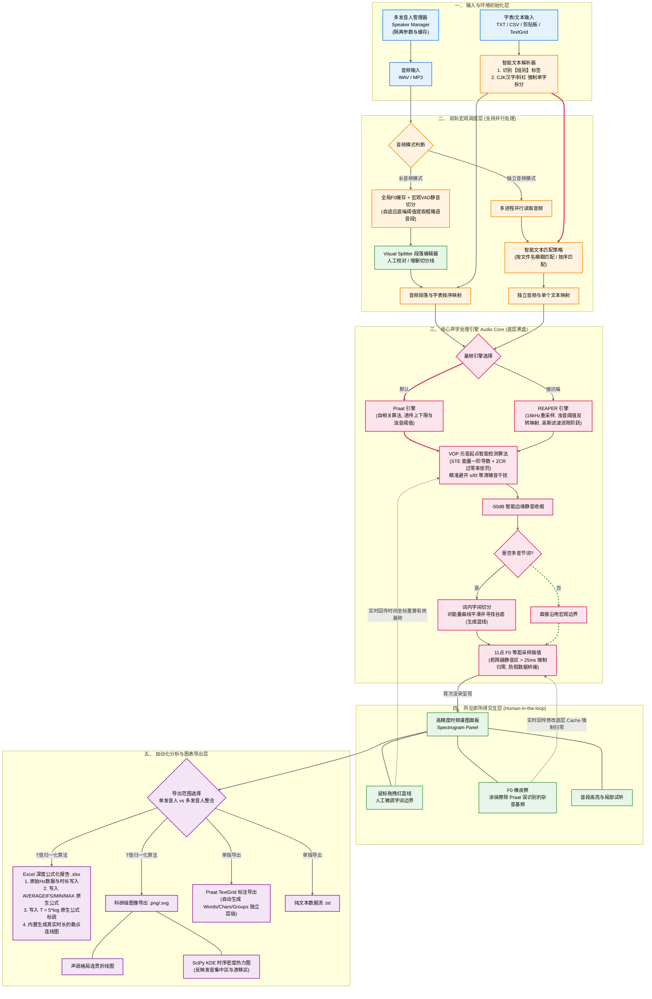
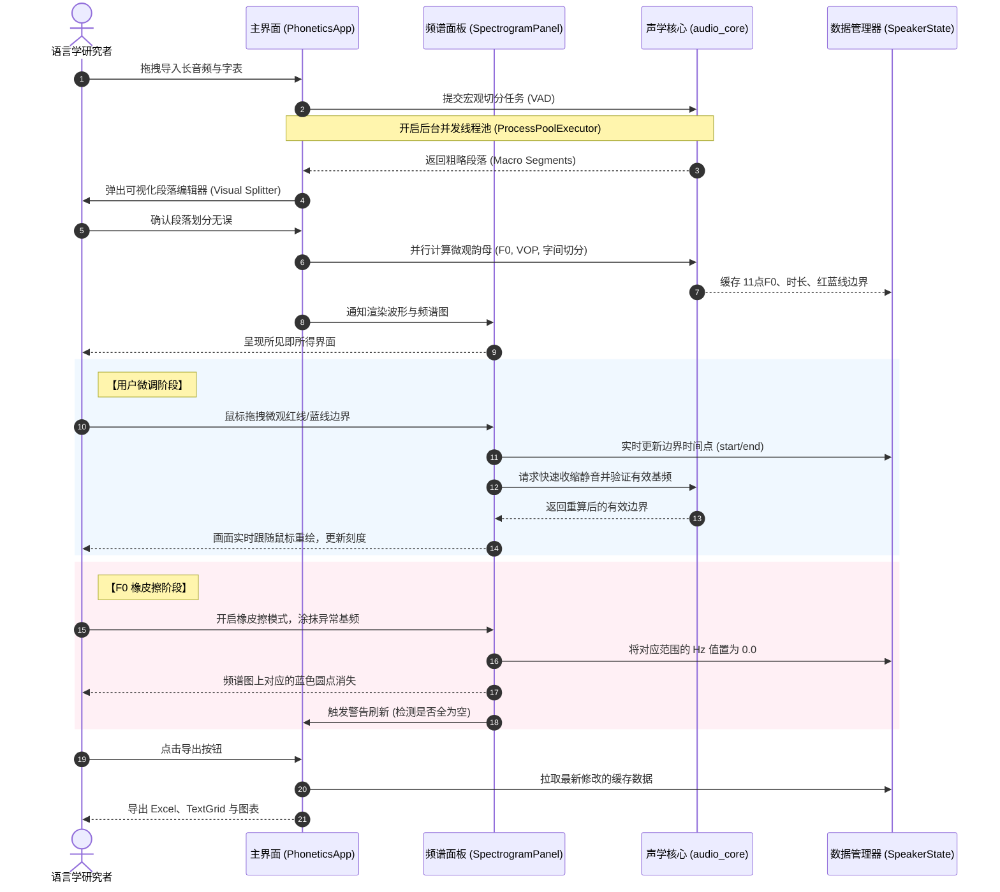

<div align="center">
  
  <h1>PhonTracer</h1>
  <p><strong>一款专注、高效的语音声调特征批量提取工具</strong></p>

  <p>
    
    
    
    
  </p>
</div>

---

###  项目简介

> **PhonTracer** 是一个专为语音学、方言学和声调声学分析设计的轻量级桌面工具。
> 其**核心功能**是：将输入的语音音频，自动化、批量地转换为提取好核心声调（基频）特征的结构化数据格式。

无论你是处理整段的长录音，还是已经切分好的独立字音文件，本工具都能帮助你快速定位有效发音段，提取基频（F0）数据，并导出为标准格式。

---

###  声学处理流与可靠性验证

本项目在底层深度集成了 **Praat** 的核心算法（通过 `parselmouth` 调用），确保所提取的 F0 数据与在 Praat 软件中手动测量的结果具有**同等的可靠性**。

以下是程序将生语料转化为标准化数据的详细算法流程：



---

###  人机交互

为了保证数据提取的高精确度，PhonTracer 设计了完整的所见即所得交互闭环，支持对声学特征和切分边界的实时人工微调：



---

###  核心工作流程

工具提供两种导入模式，以适应不同的语料整理习惯：

<table width="100%">
  <tr>
    <td width="50%" valign="top">
      <h4> 模式一：单条长音频切分</h4>
      <p><i>适用于一次性录制了整张字表、未做后期剪辑的超长音频。</i></p>
      <ul>
        <li><b>导入长音频</b>：加载完整录音文件</li>
        <li><b>文本匹配</b>：粘贴字表，执行自动 VAD 切分</li>
        <li><b>可视化微调</b>：通过交互界面手动修正边界</li>
        <li><b>精准提取</b>：定位元音核心并导出数据</li>
      </ul>
    </td>
    <td width="50%" valign="top">
      <h4> 模式二：多条独立音频提取</h4>
      <p><i>适用于已经将每个字/词剪辑为独立文件的语料库。</i></p>
      <ul>
        <li><b>批量导入</b>：一键选中所有单字音频文件</li>
        <li><b>智能映射</b>：
          <ul>
            <li>模糊匹配：自动根据文件名识别文字</li>
            <li>顺序匹配：按文件导入顺序对应</li>
          </ul>
        </li>
        <li><b>并行提取</b>：多进程加速，同步处理所有语料</li>
      </ul>
    </td>
  </tr>
</table>

---

###  核心参数控制

- **等分点 (N)**：在元音核心段内均匀采样基频的次数（默认 11 点），是归一化声调曲线的基础。
- **能量落差 (dB)**：算法基于最大能量点向两侧寻找边界，设定允许的能量下降阈值。
- **最短时长**：自动过滤极短的突发噪声，确保数据有效性。
- **边缘静音裁切**：自动忽略两端低于 -50dB 的绝对静音，提高波形聚焦度。

---

###  输出数据

所有流程的最终目的都是输出高度标准化的特征与图表，目前支持以下 5 种数据/格式导出：

<table width="100%">
  <tr>
    <td width="50%" valign="top">
      <h4>1. Excel 深度公式化报告 (.xlsx)</h4>
      <p><i>面向数据统计与公式化建模的深度报告。</i></p>
      <ul>
        <li>自动写入标准汇总数据、分析公式与逐点原始基频数据</li>
        <li>第三个工作表保留当前编辑后的 Hz 轨迹，包含橡皮擦置零点</li>
        <li>内置 <code>AVERAGEIFS/MIN/MAX</code> 原生公式，便于二次筛选</li>
        <li>应用 <code>T = 5*log</code> 经典归一化公式自动完成标调</li>
        <li>内置生成基于真实发音时长的散点连线图</li>
      </ul>
    </td>
    <td width="50%" valign="top">
      <h4>2. 声调格局折线图 (.png)</h4>
      <p><i>直观展示声调在声学空间中的时序演变。</i></p>
      <ul>
        <li>基于归一化 T 值或原始赫兹 (Hz) 生成格局折线图</li>
        <li>支持多发音人、多声调类型的对比与均值聚合</li>
        <li>可导出科研级的高分辨率位图 (PNG)</li>
      </ul>
    </td>
  </tr>
  <tr>
    <td width="50%" valign="top">
      <h4>3. KDE 时序密度热力图 (.png / .svg)</h4>
      <p><i>基于 SciPy 二维核密度估计 (KDE) 的可视化。</i></p>
      <ul>
        <li>直观反映样本在不同发音时序段的基频游移规律</li>
        <li>使用最终字段边界与当前基频缓存，忠实反映手动擦除后的数据缺口</li>
        <li>以热力图斑点深度揭示发音最集中的核心区</li>
        <li>极佳的科研配图，利于展示声调变体的离散度</li>
      </ul>
    </td>
    <td width="50%" valign="top">
      <h4>4. Praat TextGrid 标注文件 (.TextGrid)</h4>
      <p><i>方便在 Praat 中进行二次校验或联动分析。</i></p>
      <ul>
        <li>自动将切分结果生成为标准 TextGrid 标注文件</li>
        <li>包含独立的 Words (词)、Chars (字) 和 Groups (组别) 标记层</li>
        <li>可直接在 Praat 中打开与原始音频无缝对齐</li>
      </ul>
    </td>
  </tr>
  <tr>
    <td colspan="2" valign="top">
      <h4>5. 原始特征纯文本数据 (.txt)</h4>
      <p><i>最轻量、通用的原始文本数据流。</i></p>
      <ul>
        <li>以纯文本/CSV 格式输出每个切分音段的基频时序轨迹</li>
        <li>非常适合直接导入 R、Python (Pandas)、SPSS 等第三方软件进行深度自定义建模</li>
      </ul>
    </td>
  </tr>
</table>

> 以上导出的所有数据与图像，均可在应用内部直接一键生成，完美契合从“原始语料”到“科研级可视化与统计表”的完整分析闭环。


---

###  本地运行

```bash
# 1. 克隆仓库
git clone https://github.com/KasumiKitsune/Tone_extractor.git
cd Tone_extractor

# 2. 安装依赖 (建议在虚拟环境下执行)
pip install -r requirements.txt

# 3. 启动程序
python main.py
```

<br>

<div align="center">
  
  <p>© 2026 KasumiKitsune</p>
</div>
