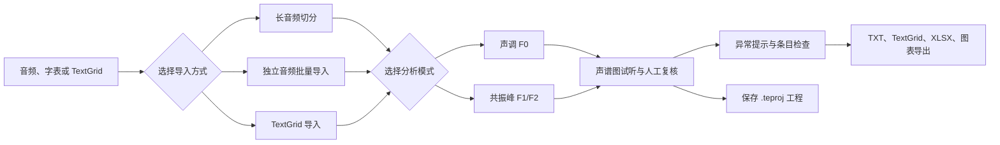

# `README.md` 重写与补充说明

> 本文档用于交接给后续 AI：请依据本文档重写和补充仓库根目录的 `README.md`。
> 本轮只新增本文档，没有直接修改 `README.md`。
> 审阅基准：`main` 分支，提交 `8dc350a`，标签 `v1.2.0`。

## 0. 后续 AI 的执行规则

1. 先完整阅读本文档，再修改 `README.md`。
2. 不要把本文档机械拼接到现有 README 末尾。应重组 README 的信息层级，使首页适合第一次接触项目的用户阅读。
3. README 应以“可快速理解、可快速安装、可快速开始”为目标。复杂操作细节应链接到 `assets/manual/manual.md`，不要把首页写成完整用户手册。
4. README 中的功能说明必须以当前代码为准，不要照抄旧 README、旧 `CHANGELOG.md` 或历史手册中的过时表述。
5. 不要使用无法由代码或测试支撑的学术性承诺，例如“与 Praat 手工测量具有同等可靠性”“完美契合科研流程”“在所有噪声条件下更稳健”。
6. `.teproj` 自动保存的表述必须谨慎：当前代码确认存在内部恢复工作区，但没有确认自动创建备份归档文件的有效调用链。不要承诺自动生成 `auto_save_backup.teproj`。
7. CLI 的 `analysis_mode` 文档必须以 `f0` 和 `formant` 为准。不要将 `pitch` 写成推荐值，原因见本文档第 10 节。
8. Windows 主程序支持窗口级文件拖拽；独立 `Toolkit` 已主动关闭窗口级文件拖拽。README 必须区分两者。
9. 更新功能应写为“可在关于窗口中手动检查更新”。不要写成“程序会自动检查更新”。
10. 修改后至少执行一次 Markdown 人工检查，并运行本文档第 12 节列出的验证命令。

---

## 1. 本轮审阅范围

### 1.1 仓库快照

| 项目 | 当前状态 |
| --- | --- |
| 当前分支 | `main` |
| 当前提交 | `8dc350a` |
| 当前标签 | `v1.2.0` |
| 应用名称 | `PhonTracer` |
| 版本来源 | `modules/version.py` |
| 打包工作流 | `.github/workflows/package-windows.yml`、`.github/workflows/package-macos.yml`、`.github/workflows/package-windows-arm64.yml` |
| 当前套件打包配置 | `ToneExtractor_Suite.spec` |
| 主要用户手册 | `assets/manual/manual.md` |

### 1.2 已审阅的代码类别

本轮不是只阅读 `README.md`，而是对仓库中的主要代码、测试和打包配置进行了全量盘点，并对关键链路逐层阅读：

- 桌面主程序入口：`main.py`
- 独立工具箱：`toolkit.py`
- Windows 命令行工作台：`cli.py`
- 桌面主界面和启动恢复：`modules/app.py`
- 声学分析核心：`modules/audio_core.py`
- 数据解析与导出：`modules/data_utils.py`
- 说话人参数：`modules/speaker_manager.py`
- 项目持久化：`modules/project_manager.py`
- 项目导入预览：`modules/project_import_dialog.py`
- 声谱图面板：`modules/spectrogram_panel.py`
- 项目树、异常提示和导出入口：`modules/project_tree.py`
- 异常检测：`modules/anomaly_detection.py`
- 科学图表导出器：`modules/acoustic_exporter.py`
- 关于窗口和更新机制：`modules/about_dialog.py`、`modules/updater.py`
- 打包和安装：`ToneExtractor_Suite.spec`、`ToneExtractor.spec`、`installer.iss`
- 发布工作流：`.github/workflows/package-windows.yml`、`.github/workflows/package-macos.yml`、`.github/workflows/package-windows-arm64.yml`
- 依赖：`requirements.txt`
- 自动化测试：`tests/`

### 1.3 已完成的验证

使用仓库惯用的 Python 3.12 解释器执行：

```powershell
& 'C:\Users\Sager\AppData\Local\Programs\Python\Python312\python.exe' -m pytest -q
```

结果：

```text
159 passed, 4 warnings
```

警告来自第三方依赖中的弃用提示，没有测试失败。

同时执行：

```powershell
& 'C:\Users\Sager\AppData\Local\Programs\Python\Python312\python.exe' -m compileall -q main.py cli.py toolkit.py modules tests
```

结果：编译检查通过，没有输出错误。

---

## 2. README 当前存在的主要问题

### 2.1 必须修正的问题

| 优先级 | 当前 README 位置 | 问题 | 修改要求 |
| --- | --- | --- | --- |
| 高 | 顶部发布徽章 | 仍显示 `v1.1.0`，代码和标签已经是 `v1.2.0` | 更新为 `v1.2.0`，或改为动态链接到 GitHub Releases |
| 高 | 项目定位 | 仍将项目描述为“语音声调特征批量提取工具” | 改为同时覆盖声调 `F0`、共振峰 `F1/F2`、人工复核、工程保存和导出的语音声学分析套件 |
| 高 | 方法说明 | 声称 F0 与 Praat 手工测量具有“同等可靠性” | 删除绝对承诺，改为谨慎说明 Praat 引擎的来源、人工复核的重要性和参数依赖 |
| 高 | 功能流程图 | 只描述 F0 路径 | 增加 `F0` 与共振峰双模式、`.teproj` 工程、异常检查和多格式导出 |
| 高 | 参数说明 | 只列出 F0 参数 | 增加共振峰参数：最大共振峰频率、共振峰数量、窗长、预加重和采样策略 |
| 高 | 导出说明 | 写成固定的“五种格式” | 改为按类别列举：`TXT`、`TextGrid`、`XLSX`、科学图表、工程归档 |
| 高 | 开发运行 | 只介绍 `python main.py` | 增加 `toolkit.py`、`cli.py`，并说明 Windows 打包套件的三个入口 |
| 高 | 自动保存 | 旧手册中存在自动备份归档描述 | README 只写内部恢复工作区，不要承诺自动生成备份归档 |
| 高 | CLI 模式值 | CLI 帮助中存在 `pitch` 与图形界面 `f0` 不一致 | README 示例使用 `analysis_mode=f0` 或 `analysis_mode=formant` |

### 2.2 建议补充的问题

| 优先级 | 缺失主题 | 修改要求 |
| --- | --- | --- |
| 中 | 三入口套件 | 明确 `PhonTracer`、`Toolkit`、`PhonTracerCLI` 的用途和平台差异 |
| 中 | `.teproj` 工程 | 说明可保存音频、分析结果、说话人参数和人工修改，支持导入预览与覆盖方式选择 |
| 中 | 多说话人管理 | 说明每位说话人拥有独立参数和分析状态 |
| 中 | 共振峰模式 | 说明 `F1/F2` 提取、推荐参数、人工删除异常点和图表导出 |
| 中 | 异常检查 | 说明项目树会提示边界、缺失分析点、异常跳变和跨边界拆分风险 |
| 中 | 图表导出器 | 说明支持 `PNG`、`SVG`、`PDF`，并按 F0 与共振峰列出图表类型 |
| 中 | 安装与发布 | 增加 GitHub Releases、Windows 安装包、Windows 压缩包和 macOS `DMG` |
| 中 | 用户手册 | 将 `assets/manual/manual.md` 作为详细操作手册链接 |
| 中 | 测试 | 增加测试命令和当前验证结果 |
| 中 | 已知边界 | 说明人工复核仍然必要，自动参数建议不是最终判断 |
| 中 | 更新机制 | 说明关于窗口支持手动检查更新 |

### 2.3 应删除或弱化的营销表述

以下类型的句子不应继续出现在 README 中：

- “确保与 Praat 手动测量具有同等可靠性”
- “完美契合语音学科研流程”
- “自动识别结果无需人工复核”
- “无法可靠测量的片段也能自动补齐”
- “支持所有音频格式”
- “自动保存一定会生成可直接分发的备份工程包”
- “跨平台 CLI”

建议统一改成可验证、可解释的描述，例如：

> PhonTracer 通过 Parselmouth 调用 Praat 的音高与共振峰分析能力，并提供可视化人工复核、异常提示和批量导出。自动分析结果会受到录音质量、说话人参数和分段边界影响，正式使用前仍应进行人工检查。

---

## 3. README 的推荐定位

### 3.1 推荐的一句话定位

可直接使用：

> PhonTracer 是一个面向语音学标注与声学分析的桌面工具套件，支持批量提取和人工复核声调 `F0`、共振峰 `F1/F2`，并提供 `.teproj` 工程保存、异常提示、多说话人管理、科学图表导出和 Windows 命令行工作台。

### 3.2 推荐的目标用户

README 应明确面向以下用户：

- 需要批量处理单字、词语或长录音的语音学研究者
- 需要在自动提取后进行可视化人工复核的用户
- 需要按说话人保存参数并导出可复现工程的用户
- 需要通过命令行或 AI 代理执行批处理任务的 Windows 用户

### 3.3 README 首页与手册的边界

README 首页适合回答：

1. 这个项目是什么？
2. 它解决什么问题？
3. 有哪些入口？
4. 如何安装和开始使用？
5. 可以导出什么？
6. 有哪些重要边界？
7. 去哪里看详细教程？

完整手册适合回答：

- 每个按钮在哪里
- 每一个参数如何设置
- 长音频和批量导入的逐步操作
- 图表导出器的所有筛选选项
- CLI 的完整命令参考
- `.teproj` 的导入覆盖细节

---

## 4. 推荐的 README 最终目录

建议按以下顺序重写：

```text
# PhonTracer
一句话定位
徽章

## 核心能力
## 套件组成
## 工作流程
## 分析模式
### 声调 F0
### 共振峰 F1/F2
## 输入方式
## 人工复核与异常提示
## 工程保存与恢复
## 导出能力
## 科学图表
## 安装
## 快速开始
### 图形界面
### 从源码运行
### CLI 快速示例
## 详细手册
## 验证与测试
## 已知边界
## 项目结构
## 更新与发布
## 许可证或引用说明
```

如果 README 过长，可以将“项目结构”和完整 CLI 命令表缩短，但不应删除“已知边界”。

---

## 5. 可直接采用的顶部区域

### 5.1 标题与简介

建议将现有开头重写为：

```markdown
# PhonTracer

PhonTracer 是一个面向语音学标注与声学分析的桌面工具套件，支持批量提取和人工复核声调 `F0`、共振峰 `F1/F2`，并提供 `.teproj` 工程保存、异常提示、多说话人管理、科学图表导出和 Windows 命令行工作台。

项目通过 [Parselmouth](https://parselmouth.readthedocs.io/) 调用 Praat 的声学分析能力，适合需要“自动提取 + 可视化复核 + 批量导出”工作流的研究和教学场景。
```

### 5.2 徽章

建议保留简洁的徽章，不要堆叠过多状态：

```markdown
[](https://github.com/SagerNet/tone_extractor/releases)
[](https://www.python.org/)
[](#安装)
```

注意：

- 当前发布标签确认是 `v1.2.0`。
- GitHub Actions 打包环境使用 Python 3.12。
- 不建议继续写未经当前自动化测试证明的 `Python 3.10+`。
- Windows 套件包含 CLI；macOS 套件不应承诺包含 CLI。

---

## 6. 核心能力与套件组成

### 6.1 推荐的“核心能力”文案

可直接使用：

```markdown
## 核心能力

- **双分析模式**：支持声调 `F0` 与共振峰 `F1/F2` 提取，可按任务切换分析模式。
- **自动分析与人工复核结合**：在声谱图中查看轮廓、试听音频、调整边界，并删除明显异常的分析点。
- **两类导入流程**：支持“长音频 + 字表”切分，也支持批量导入独立音频文件。
- **TextGrid 互操作**：支持导入和导出 TextGrid，便于与 Praat 工作流衔接。
- **多说话人管理**：每位说话人拥有独立的 F0 与共振峰参数，可按说话人导出结果。
- **异常提示**：在项目树中提示边界问题、分析点缺失、跳变异常和跨边界拆分风险，帮助用户定位需要复核的条目。
- **工程归档**：通过 `.teproj` 保存音频、分析结果、参数和人工修改，便于中断后继续工作。
- **科学图表导出**：支持 `PNG`、`SVG` 和 `PDF`，覆盖 F0 轮廓、分布、密度、热图以及共振峰空间和轨迹等图表。
```

### 6.2 推荐的“套件组成”表格

可直接使用：

```markdown
## 套件组成

| 入口 | 用途 | 平台说明 |
| --- | --- | --- |
| `PhonTracer` | 主桌面程序：导入、分析、人工复核、异常检查、工程保存和导出 | Windows、macOS |
| `Toolkit` | 独立工具箱：音频合并、长音频切分、批量整理和工程预览 | Windows、macOS |
| `PhonTracerCLI` | 面向批处理与 AI 代理的命令行工作台 | 当前随 Windows 套件发布 |
```

补充说明：

- `ToneExtractor_Suite.spec` 是当前发布套件的主要打包依据。
- 旧的 `ToneExtractor.spec` 是单程序打包配置，不应作为 README 首页的主要介绍对象。
- Windows 安装脚本 `installer.iss` 会创建三个入口的快捷方式，并注册 `.teproj` 文件关联。

---

## 7. 推荐工作流程

### 7.1 用简化流程图替换旧图

当前 README 的大段流程图只覆盖 F0，信息过时且过细。建议替换为：

````markdown
## 工作流程


````

注意：复制到 README 时只保留内部的 Mermaid 围栏。

### 7.2 推荐的工作流说明

可直接使用：

```markdown
一个典型工作流如下：

1. 创建或切换说话人，并设置适合该说话人的分析参数。
2. 导入长音频和字表、批量导入独立音频，或载入已有 TextGrid。
3. 选择声调 `F0` 或共振峰 `F1/F2` 模式并执行分析。
4. 在声谱图中试听音频、检查分段边界和分析点，必要时手动修正。
5. 根据项目树中的异常提示复核可疑条目。
6. 导出文本、TextGrid、Excel 或科学图表。
7. 将当前工作保存为 `.teproj` 工程，便于后续继续分析。
```

---

## 8. 输入、分析与人工复核

### 8.1 输入方式

建议写成：

```markdown
## 输入方式

PhonTracer 支持三类常见输入流程：

| 输入方式 | 适用场景 | 说明 |
| --- | --- | --- |
| 长音频 + 字表 | 连续录音按词条拆分 | 字表支持分组标题；程序根据音频分析和条目顺序生成切分结果 |
| 独立音频批量导入 | 每个词条已有单独音频文件 | 可批量导入 `WAV` 和 `MP3` 文件 |
| TextGrid 导入 | 已有 Praat 标注或需要继续复核 | 支持载入已有分段信息，并在当前工程中继续分析 |
```

不要写成“支持所有音频格式”。当前主流程明确过滤 `WAV` 和 `MP3`。

### 8.2 声调 F0 模式

建议写成：

```markdown
### 声调 F0

- 默认通过 Parselmouth 调用 Praat 自相关音高分析。
- 支持设置音高下限、音高上限、静音阈值、前端跳过比例和浊音阈值。
- 支持按说话人估计推荐 F0 范围。
- 支持在声谱图中检查轮廓，并删除明显异常的 F0 点。
- 对无法可靠测量的片段保留缺失值，避免将嘎裂声等异常发声误当作稳定 F0。
```

不要写：

- “无法可靠测量的片段也能自动补齐”
- “自动估计结果可替代人工检查”
- “所有声调轮廓都能一次性正确识别”

### 8.3 共振峰 F1/F2 模式

建议写成：

```markdown
### 共振峰 F1/F2

- 通过 Parselmouth 调用 Praat 的 Burg 共振峰分析。
- 支持提取和显示 `F1`、`F2`，内部同时保留 `F3` 数据用于导出和检查。
- 支持设置最大共振峰频率、共振峰数量、窗长、预加重和采样策略。
- 支持根据当前说话人的样本生成参数建议。
- 支持在声谱图中检查共振峰轨迹，并删除明显异常的分析点。
```

参数表可写成：

| 参数 | 内部字段 | 默认值 | 说明 |
| --- | --- | --- | --- |
| 最大共振峰频率 | `formant_max_hz` | `5500` | 控制共振峰搜索范围 |
| 共振峰数量 | `formant_count` | `5` | Praat Burg 分析参数 |
| 窗长 | `formant_window_length` | `0.025` | 单位为秒 |
| 预加重 | `formant_pre_emphasis` | `50` | 单位为赫兹 |
| 采样策略 | `formant_sample_strategy` | `整段11点` | 控制导出时的采样位置 |

### 8.4 人工复核与异常提示

建议写成：

```markdown
## 人工复核与异常提示

自动提取不是最终结论。PhonTracer 将分析结果放回可试听、可编辑的声谱图界面，帮助用户完成复核：

- 播放当前音频并查看声谱图
- 调整词条和字符边界
- 检查 F0 轮廓或共振峰轨迹
- 删除明显异常的分析点
- 在项目树中定位“需要检查”的条目

项目树会针对边界异常、分析点缺失、有效点比例不足、跳变异常以及跨边界拆分风险给出提示。提示用于辅助人工检查，不应被理解为自动质量认证。
```

---

## 9. 工程保存、恢复与更新机制

### 9.1 `.teproj` 工程

建议写成：

```markdown
## 工程保存与恢复

PhonTracer 使用 `.teproj` 作为可移植工程归档格式。工程可保存：

- 说话人和参数设置
- 导入的音频
- 条目、分组和边界信息
- F0 与共振峰分析结果
- 人工删除或调整后的分析状态

导入已有工程时，程序会先显示预览；如果当前工作区已有内容，可选择覆盖或叠加导入。

启用自动保存后，程序会将当前状态写入内部恢复工作区，并在下次启动时提供恢复提示。需要跨设备传输、归档或分享时，请显式导出 `.teproj` 工程。
```

### 9.2 不要错误承诺备份归档

当前 `modules/project_manager.py` 中存在：

```python
self.backup_path = self.app_data_dir / "auto_save_backup.teproj"
```

也存在 `_create_backup()` 方法，但本轮全仓库检索没有发现有效调用方。当前自动保存链路确认写入：

```text
~/.phon_tracer/workspace
```

因此 README 不应写：

```text
程序会自动在 ~/.phon_tracer/auto_save_backup.teproj 创建备份工程包。
```

应写：

```text
程序会将自动保存状态写入内部恢复工作区；需要归档或分享时，请显式导出 .teproj。
```

### 9.3 更新机制

建议写成：

```markdown
## 更新与发布

- 可在“关于”窗口中手动检查 GitHub Releases 更新。
- Windows 提供安装包和便携压缩包。
- macOS 提供 `DMG`。
- GitHub Actions 会在手动触发或推送版本标签时构建发布套件。
```

不要写“程序启动后自动检查更新”。`modules/app.py` 中的自动检查调用当前已被禁用。

---

## 10. 导出能力

### 10.1 推荐的导出矩阵

不要继续写“支持五种格式”。建议改成按用途组织：

```markdown
## 导出能力

| 类别 | 格式 | 适用场景 |
| --- | --- | --- |
| 文本数据 | `TXT` | 轻量查看和后续脚本处理；文本结果采用制表符分隔 |
| Praat 标注 | `TextGrid` | 与 Praat 标注和复核流程衔接 |
| 表格分析 | `XLSX` | 批量结果、原始数据和分析图表 |
| 科学图表 | `PNG`、`SVG`、`PDF` | 报告、论文制图和批量图表归档 |
| 工程归档 | `.teproj` | 保存完整分析状态，便于恢复、迁移和分享 |
```

说明：

- 不要把 `TXT` 写成 CSV。当前主文本导出采用制表符分隔。
- `.teproj` 是工程归档，不应与最终统计数据导出混为一谈。
- `XLSX` 在共振峰模式下包含“提取数据”“分析图表”“原始数据”等工作表。

### 10.2 科学图表

建议写成：

```markdown
## 科学图表

图表导出器支持当前说话人、分说话人和综合视图，可导出 `PNG`、`SVG` 与 `PDF`。

### F0 图表

- F0 轮廓图
- F0 分布图
- F0 密度图
- 数据质量图
- 综合热图

### 共振峰图表

- 共振峰空间图
- 共振峰轨迹图
- 共振峰密度图
- 共振峰综合热图
```

可以补充：

- 图表支持预览、分页和取消导出。
- 分组较多时会自动分页。
- PDF 可用于批量图册导出。

不要写“所有图表都已完成科学有效性验证”。更稳妥的表述是“面向科学分析与报告制作的可视化导出器”。

---

## 11. 独立工具箱

### 11.1 推荐文案

```markdown
## Toolkit

`Toolkit` 是独立音频预处理工具，适合在进入主分析流程前整理素材：

- 合并多个音频文件并输出 `WAV`
- 根据字表拆分长音频
- 批量整理独立音频文件
- 预览并保存工程归档

在 Windows 环境中，为规避 Tk 与窗口级拖拽组合下的偶发崩溃，`Toolkit` 已关闭窗口级文件拖拽。请使用界面中的文件选择按钮导入素材。
```

### 11.2 与主程序区分

README 必须明确：

| 入口 | 文件拖拽说明 |
| --- | --- |
| 主程序 `PhonTracer` | Windows 下支持窗口级拖拽导入，回调会转交主线程处理 |
| `Toolkit` | 已关闭窗口级拖拽，请使用按钮导入 |

不要笼统写成“套件所有界面都支持拖拽导入”。

---

## 12. CLI 说明

### 12.1 推荐定位

```markdown
## PhonTracerCLI

Windows 套件包含 `PhonTracerCLI`，用于批处理、自动化脚本和 AI 代理工作流。CLI 支持交互模式，也支持执行单条命令后退出。
```

### 12.2 可列出的命令类别

不必把全部帮助文本塞进 README，但可以列出：

| 类别 | 代表命令 | 用途 |
| --- | --- | --- |
| 帮助 | `help`、`agent_guide` | 查看命令和 AI 代理建议 |
| 说话人 | `speakers`、`add_speaker`、`switch_speaker`、`remove_speaker` | 管理多说话人 |
| 导入 | `load_long`、`load_batch`、`apply_wordlist`、`apply_textgrid` | 导入长音频、批量音频、字表和 TextGrid |
| 检查 | `status`、`list_items`、`log` | 查看当前状态、条目和日志 |
| 编辑 | `modify_bounds`、`modify_params` | 修改边界和参数 |
| 重算 | `recalculate`、`detect_f0` | 重算分析结果或估计 F0 范围 |
| 导出 | `export`、`import_batch_and_export` | 导出分析结果 |
| 工程 | `project_export`、`project_import`、`project_save`、`autosave` | 保存、导入工程和控制自动保存 |
| 工具箱 | `tool_merge`、`tool_sort_batch`、`tool_split` | 音频合并、排序和切分 |

### 12.3 推荐示例

源码运行：

```powershell
python cli.py
python cli.py status
python cli.py help export
```

Windows 打包后：

```powershell
PhonTracerCLI.exe
PhonTracerCLI.exe status
PhonTracerCLI.exe help export
```

参数示例：

```text
modify_params analysis_mode=f0
modify_params analysis_mode=formant
```

### 12.4 必须规避的模式值不一致

当前代码存在一个需要后续单独修复的实现差异：

- 图形界面的内部值是 `f0` 和 `formant`。
- `modules/speaker_manager.py` 的默认值是 `analysis_mode='f0'`。
- `modules/app.py` 按 `analysis_mode == 'f0'` 判断声调模式，否则进入共振峰模式。
- `cli.py` 的部分帮助文本却写成 `pitch` 和 `formant`。
- CLI 参数修改目前允许直接写入任意字符串。

这意味着：如果 CLI 将 `analysis_mode` 保存为 `pitch`，图形界面重新载入工程后可能将其误判为共振峰模式。

README 的处理方式：

1. 对普通用户写“声调 `F0` 模式”和“共振峰 `F1/F2` 模式”。
2. CLI 示例只使用 `analysis_mode=f0` 和 `analysis_mode=formant`。
3. 不要复制 CLI 帮助中的 `pitch` 作为推荐值。
4. 将代码修复留作后续任务，不要在 README 中展开内部缺陷。

---

## 13. 安装与快速开始

### 13.1 推荐安装说明

```markdown
## 安装

请优先从 [GitHub Releases](https://github.com/SagerNet/tone_extractor/releases) 下载已构建版本。

### Windows

- 安装版：运行发布页中的安装程序。
- 便携版：解压发布页中的 Windows 压缩包后运行 `PhonTracer.exe`。
- 安装程序会注册 `.teproj` 文件关联，并提供 `PhonTracer`、`Toolkit` 和 `PhonTracerCLI` 入口。

### macOS

- 下载发布页中的 `DMG`。
- 打开镜像后，将应用拖入“应用程序”目录。

当前 Windows 套件包含命令行入口；macOS 主要提供图形界面应用。
```

### 13.2 推荐源码运行说明

````markdown
## 从源码运行

建议使用 Python 3.12。

```powershell
git clone https://github.com/SagerNet/tone_extractor.git
cd tone_extractor
python -m pip install -r requirements.txt
python main.py
```

其他入口：

```powershell
python toolkit.py
python cli.py
```
````

### 13.3 推荐快速开始

```markdown
## 快速开始

1. 启动 `PhonTracer`。
2. 创建说话人，并根据任务选择声调 `F0` 或共振峰 `F1/F2` 模式。
3. 导入长音频和字表、批量导入独立音频，或导入已有 TextGrid。
4. 在声谱图中试听和复核分析结果。
5. 根据项目树中的提示检查可疑条目。
6. 导出所需数据或图表。
7. 导出 `.teproj` 工程，以便后续恢复和分享。
```

---

## 14. 详细手册、测试与项目结构

### 14.1 用户手册

建议增加：

```markdown
## 详细手册

README 只提供快速概览。完整操作步骤、参数说明和进阶工作流请查看：

- [用户手册](assets/manual/manual.md)
```

注意：仓库中现有手册已经比旧 README 更全面，但后续仍应单独检查手册中的自动备份归档描述，避免继续承诺未确认的 `auto_save_backup.teproj` 自动生成行为。

### 14.2 验证与测试

建议增加：

````markdown
## 验证与测试

```powershell
python -m pytest -q
python -m compileall -q main.py cli.py toolkit.py modules tests
```

在 `v1.2.0` 对应代码上，使用 Python 3.12 执行测试：

```text
159 passed, 4 warnings
```

当前警告来自第三方依赖中的弃用提示。
````

如果 README 不希望写死测试数量，可删去数量，只保留命令。

### 14.3 项目结构

建议写成简洁版本：

````markdown
## 项目结构

```text
main.py                         # 主桌面程序入口
toolkit.py                # 独立工具箱
cli.py                          # Windows 命令行工作台
modules/app.py                  # 主界面、启动和恢复流程
modules/audio_core.py           # F0、共振峰和音频分析核心
modules/project_manager.py      # .teproj 与自动保存工作区
modules/project_tree.py         # 项目树、异常提示和导出入口
modules/acoustic_exporter.py    # 科学图表导出器
assets/manual/manual.md         # 用户手册
ToneExtractor_Suite.spec        # 当前套件打包配置
.github/workflows/              # Windows x64、macOS ARM64、Windows ARM64 发布构建
tests/                          # 自动化测试
```
````

---

## 15. 已知边界

建议在 README 中保留一个简短但明确的边界说明：

```markdown
## 已知边界

- 自动分析结果会受到录音质量、说话人参数和分段边界影响，正式使用前仍应人工复核。
- F0 范围估计和共振峰参数建议用于辅助配置，不是最终分析结论。
- 主程序与 `Toolkit` 的拖拽行为不同：主程序支持窗口级拖拽，`Toolkit` 请使用按钮导入。
- 自动保存用于内部恢复；需要归档、迁移或分享时，请显式导出 `.teproj`。
- 当前命令行入口随 Windows 套件发布。
```

---

## 16. 本轮代码审阅发现的待办项

以下内容不一定要完整写入公开 README，但后续维护者应知晓。

### 16.1 高优先级：统一 CLI 的 `analysis_mode`

问题：

- GUI 使用 `f0` 和 `formant`。
- CLI 帮助写成 `pitch` 和 `formant`。
- CLI 当前缺少严格枚举验证。

风险：

- 通过 CLI 保存 `analysis_mode=pitch` 后，GUI 可能误判为共振峰模式。

建议后续修复：

1. 将 CLI 帮助统一为 `f0|formant`。
2. 对 CLI 参数执行枚举校验。
3. 为历史值 `pitch` 增加兼容迁移，将其规范化为 `f0`。
4. 增加 CLI 工程导出后由 GUI 重载的回归测试。

### 16.2 高优先级：澄清自动备份归档行为

问题：

- `ProjectManager` 存在 `backup_path` 和 `_create_backup()`。
- 本轮没有发现 `_create_backup()` 的有效调用链。
- 当前自动保存确认写入内部工作区。

建议后续处理：

1. 如果设计目标是自动创建备份归档，应补齐调用链和测试。
2. 如果设计目标只是内部工作区恢复，应删除或标记未使用代码。
3. 同步修订 `assets/manual/manual.md` 中的备份说明。

### 16.3 中优先级：补齐 `CHANGELOG.md`

问题：

- 当前 `CHANGELOG.md` 主要停留在 `v1.0.0`。
- 仓库标签已经到 `v1.2.0`。

建议：

- 增加 `v1.1.0` 和 `v1.2.0` 变更摘要。
- README 可链接 GitHub Releases，但不要依赖旧 `CHANGELOG.md` 描述当前功能。

### 16.4 中优先级：明确 Python 支持范围

问题：

- GitHub Actions 打包固定使用 Python 3.12。
- 当前测试也在 Python 3.12 通过。
- 旧 README 的 `Python 3.10+` 没有在本轮验证。

建议：

- README 源码安装优先写“建议 Python 3.12”。
- 如果希望继续承诺 `3.10+`，先补充多版本 CI。

### 16.5 中优先级：区分打包配置

问题：

- 仓库同时存在 `ToneExtractor.spec` 与 `ToneExtractor_Suite.spec`。
- 当前工作流使用 `ToneExtractor_Suite.spec`。

建议：

- README 只介绍套件打包。
- 后续可为旧单程序配置增加注释，或确认是否仍需保留。

### 16.6 中优先级：同步手册与 README

问题：

- `assets/manual/manual.md` 比 README 新，但仍可能包含和当前实现不完全一致的历史表述。
- README 和手册应共享同一组稳定术语。

推荐术语：

| 推荐术语 | 不推荐术语 |
| --- | --- |
| 声调 `F0` 模式 | `pitch` 模式作为用户-facing 固定名称 |
| 共振峰 `F1/F2` 模式 | 泛称“频谱模式” |
| 内部恢复工作区 | 自动备份工程包，除非补齐调用链 |
| 制表符分隔 `TXT` | CSV，除非新增真正的 CSV 导出 |
| 手动检查更新 | 自动检查更新 |

---

## 17. 代码依据索引

后续 AI 修改 README 时，可以按以下路径快速复核事实。

| 主题 | 代码依据 |
| --- | --- |
| 当前版本 `v1.2.0` | `modules/version.py` |
| 三入口套件 | `ToneExtractor_Suite.spec`、`installer.iss` |
| Windows x64、macOS ARM64 和 Windows ARM64 发布流程 | `.github/workflows/package-windows.yml`、`.github/workflows/package-macos.yml`、`.github/workflows/package-windows-arm64.yml` |
| 说话人默认 F0 与共振峰参数 | `modules/speaker_manager.py` |
| 主程序拖拽、启动恢复、模式切换 | `modules/app.py` |
| Praat F0 提取 | `modules/audio_core.py` |
| Burg 共振峰提取 | `modules/audio_core.py` |
| 字表解析、TextGrid 和文本导出 | `modules/data_utils.py` |
| `.teproj`、内部工作区、导入导出 | `modules/project_manager.py` |
| 工程导入预览和覆盖方式 | `modules/project_import_dialog.py` |
| 声谱图、工程按钮和自动保存开关 | `modules/spectrogram_panel.py` |
| 项目树异常提示和导出入口 | `modules/project_tree.py` |
| F0 异常点判断 | `modules/anomaly_detection.py` |
| 图表类型和图表导出格式 | `modules/acoustic_exporter.py` |
| 独立工具箱 | `toolkit.py` |
| CLI 命令和单条命令模式 | `cli.py` |
| 手动检查更新和快捷入口 | `modules/about_dialog.py`、`modules/updater.py` |
| 自动化测试 | `tests/` |

---

## 18. 推荐的最终检查清单

后续 AI 修改 README 后，应逐项确认：

### 18.1 内容准确性

- [ ] 发布版本不再显示 `v1.1.0`
- [ ] 项目定位同时包含 F0 和共振峰
- [ ] 明确区分 `PhonTracer`、`Toolkit` 和 `PhonTracerCLI`
- [ ] 说明 CLI 当前随 Windows 套件发布
- [ ] 输入方式包含长音频、批量独立音频和 TextGrid
- [ ] 说明多说话人参数管理
- [ ] 说明 `.teproj` 工程用途
- [ ] 自动保存只描述内部恢复工作区
- [ ] 没有承诺自动生成 `auto_save_backup.teproj`
- [ ] 图表格式包含 `PNG`、`SVG` 和 `PDF`
- [ ] 文本导出写为制表符分隔 `TXT`
- [ ] 更新机制写为手动检查
- [ ] CLI 示例使用 `analysis_mode=f0|formant`

### 18.2 表述边界

- [ ] 没有“同等可靠性”绝对承诺
- [ ] 没有“完美契合”宣传句
- [ ] 没有将自动建议写成最终结论
- [ ] 没有承诺自动补齐无法可靠测量的 F0
- [ ] 没有笼统承诺所有音频格式
- [ ] 没有笼统承诺所有窗口支持拖拽

### 18.3 技术验证

- [ ] Markdown 标题层级连续
- [ ] Mermaid 围栏可正确渲染
- [ ] 相对链接 `assets/manual/manual.md` 可打开
- [ ] GitHub Releases 链接正确
- [ ] 执行 `python -m pytest -q`
- [ ] 执行 `python -m compileall -q main.py cli.py toolkit.py modules tests`
- [ ] 使用 `git diff -- README.md` 人工检查最终改动

---

## 19. 推荐的重写策略

为了减少遗漏，后续 AI 可以按以下顺序执行：

1. 保留现有 Logo 和项目标题。
2. 重写一句话定位和顶部简介。
3. 更新发布徽章。
4. 用“核心能力”和“套件组成”替换旧的单一 F0 介绍。
5. 用新的双模式流程图替换旧流程图。
6. 增加 F0 与共振峰两个分析小节。
7. 增加人工复核、异常提示和 `.teproj` 工程说明。
8. 用导出矩阵替换固定格式数量说明。
9. 增加科学图表、Toolkit 和 CLI 小节。
10. 补齐安装、源码运行、手册、测试和已知边界。
11. 删除无法验证的宣传句。
12. 对照第 18 节逐项复核。

---

## 20. 最小可交付版本

如果后续 AI 需要先完成一个简洁版本，至少必须包含：

1. 当前版本 `v1.2.0`
2. F0 与共振峰双模式
3. 三入口套件
4. 三类输入方式
5. 人工复核与异常提示
6. `.teproj` 工程和内部恢复工作区
7. 导出矩阵
8. Windows 与 macOS 安装说明
9. Windows CLI 示例
10. 用户手册链接
11. 测试命令
12. 已知边界

其余内容可以逐步压缩，但不要恢复旧 README 中的过度承诺。
